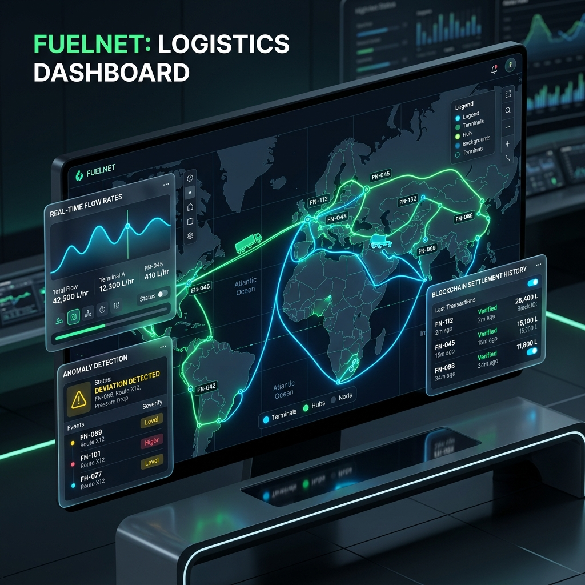
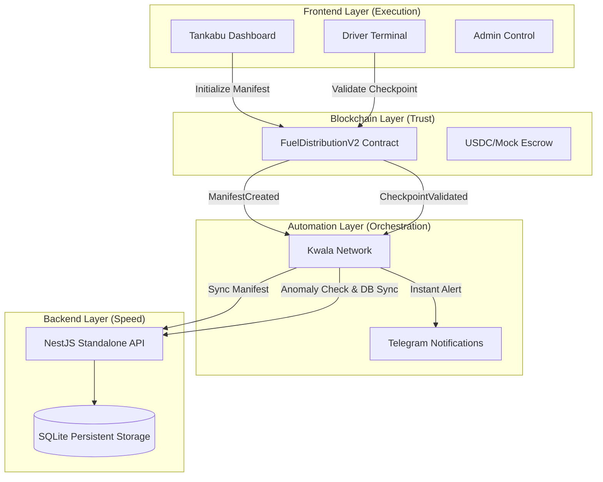

# ⛽ Tankabu: Autonomous Fuel Distribution Layer (V2)

**Tankabu** is a next-generation decentralized logistics and automation platform designed to solve the "last mile" transparency problem in fuel distribution. By leveraging a **Hybrid High-Integrity Protocol**, Tankabu combines the immutable truth of the blockchain with the high-speed performance of a standalone SQL backend, orchestrated by **Kwala's** off-chain intelligence.

---

## 🌟 Executive Summary

Traditional fuel logistics are plagued by opacity, volume theft, and slow financial settlements. Tankabu V2 introduces an autonomous layer that:
1.  **Secures Payments**: Uses on-chain escrow to ensure distributors are paid instantly upon verified delivery.
2.  **Eliminates Fraud**: Implements real-time anomaly detection at every checkpoint.
3.  **Automates Operations**: Utilizes off-chain workflows to sync data, monitor gas, and notify stakeholders.

---

## 🏗️ System Architecture

Tankabu operates on a dual-layer architecture designed for both **Trust** and **Performance**.

### The Hybrid Model
-   **On-Chain (Truth)**: Smart contracts manage product rates, manifest authorization, and fund escrow.
-   **Off-Chain (Speed)**: A NestJS/SQLite backend provides sub-second visibility into shipment history and route telemetry.
-   **Orchestration (Kwala)**: Acts as the "glue," listening for on-chain events and triggering database syncs, Telegram alerts, and gas management tasks.

---

## 🚀 Key V2 Features

### 📊 On-Chain Rate Management
Product rates (PMS, AGO, DPK) are managed directly on the smart contract. This ensures all parties (Depots, Stations, Drivers) operate on a single, immutable price source, preventing "middleman" price manipulation.

### 🚛 Intelligent Checkpoint Validation
Drivers must validate their progress at predefined milestones. The `FuelDistributionV2` contract includes built-in logic to detect volume variance. If the recorded volume drops below 95% of the dispatched volume, an **Anomaly Flag** is raised instantly.

### 🤖 Kwala-Powered Workflows
-   **Hybrid Sync**: Every on-chain validation is automatically mirrored to the SQL database for high-speed dashboard rendering.
-   **Anomaly Guard**: Immediate Telegram alerts are fired to operators when the system detects a potential fuel leak or theft.
-   **Gas Guard**: Monitors the operational liquidity of driver wallets, ensuring they always have enough gas for the next validation.

---

## 💻 Operational Terminals

The **Tankabu Frontend** provides tailored experiences for every persona in the ecosystem:

| Terminal | Purpose | Key Actions |
| :--- | :--- | :--- |
| **Admin Control** | System Governance | Update rates, manage roles, view global stats. |
| **Dispatch Central** | Manifest Initiation | Select products, set volume, authorize drivers. |
| **Driver Terminal** | Route Execution | Validate checkpoints, view route maps. |
| **Station Dashboard** | Delivery Confirmation | Confirm receipt, trigger on-chain payment release. |
| **Operator Dashboard** | Real-time Monitoring | Live map tracking, anomaly investigation. |

---

## 🛠️ Technical Stack

-   **Smart Contracts**: Solidity 0.8.28, Hardhat, OpenZeppelin.
-   **Backend**: NestJS, TypeORM, SQLite.
-   **Automation**: Kwala Network (Off-chain event listeners & actions).
-   **Frontend**: React, Vite, Tailwind CSS, Lucide Icons, Ethers.js.
-   **Infrastructure**: Render (Auto-deployment with Persistent Disks).

---

## 📈 Roadmap & Achievements

-   [x] **V1 MVP**: Basic manifest creation and manual tracking.
-   [x] **V2 Hybrid Upgrade**: Integration of SQL backend for performance.
-   [x] **Anomaly Detection**: On-chain volume variance logic.
-   [x] **Automated Notifications**: Telegram integration via Kwala.
-   [ ] **V3 Multi-Chain**: Support for cross-chain logistics tracking.
-   [ ] **AI Optimization**: Route prediction and demand forecasting.

---

## ⚖️ License
MIT
