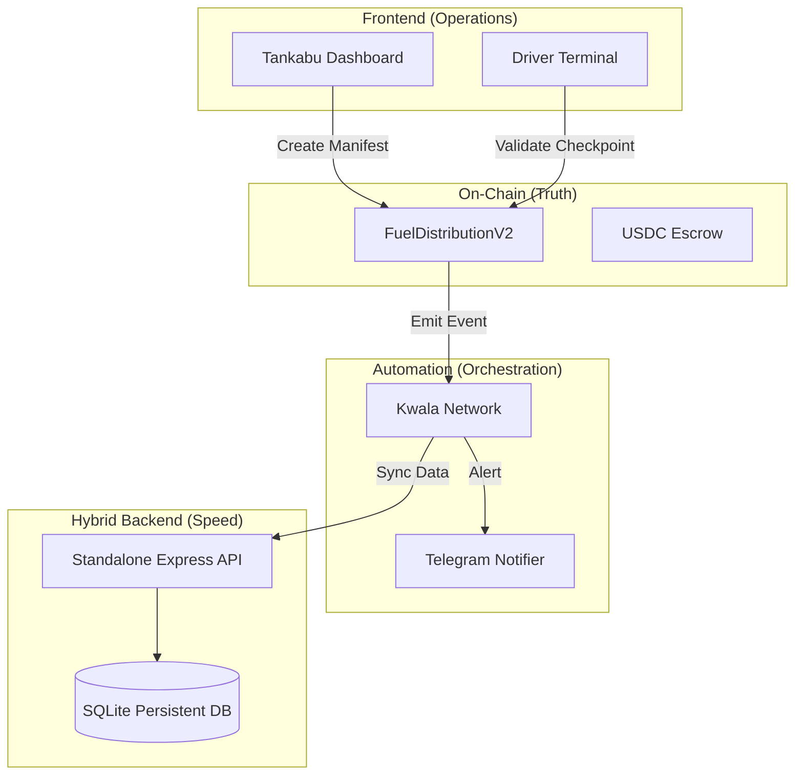

# ⛽ Tankabu: Autonomous Fuel Distribution Layer (V2)

**Tankabu** is a decentralized logistics and automation platform designed to streamline fuel distribution. By combining **FuelDistributionV2** smart contracts with a **Standalone SQL Hybrid Backend** and **Kwala's** off-chain orchestration, Tankabu ensures real-time visibility, automated rate management, and secure checkpoint validation.

---

## 🏗️ Architecture: Hybrid High-Integrity Protocol

Tankabu operates on a "Hybrid" model, where the blockchain provides the **Truth** (Rates, Payments, Validations) and the SQL Backend provides the **Speed** (Real-time tracking, Dashboard history).



---

## 🚀 Key V2 Features

- **📊 On-Chain Rate Management:** Product rates (PMS, AGO, DPK) are pulled directly from the smart contract. Only admins can update global pricing.
- **🚛 Checkpoint Validation:** Drivers validate their progress via the **Driver Terminal**. The system uses on-chain anomaly detection to flag volume variance in real-time.
- **🗄️ Standalone SQL Backend:** A lightweight Express/SQLite service designed for persistent MVP data storage and high-speed dashboard performance.
- **🔐 Secure API Sync:** All hybrid data operations are protected by `x-api-key` validation, synchronized via Kwala webhooks.
- **☁️ Cloud-Ready Deployment:** Native support for **Render** via Blueprint (`render.yaml`), including persistent disk configuration.

---

## 📂 Project Structure

```text
.
├── backend/            # Standalone Express + SQLite API (Hybrid Sync)
├── contracts/          # FuelDistributionV2 Solidity Smart Contracts
├── ignition/           # Hardhat Ignition Deployment Modules (V2)
├── kwala/              # V2 Workflow Configurations (Anomaly Alerts, DB Sync)
├── render.yaml         # Render Blueprint for automated backend deployment
└── tankabu/            # Primary React Frontend (Managed separately)
```

---

## ⚡ Technical Core

### 1. Smart Contract (V2)
- **DRIVER_ROLE**: Authorized fleet addresses for checkpoint validation.
- **validateCheckpoint**: Logic to detect volume loss between milestones.
- **updateRate**: Global pricing management by authorized administrators.

### 2. Standalone Backend
- **Endpoint**: `http://localhost:3000` (Local)
- **Security**: Protected by `BACKEND_API_KEY` in `.env`.
- **Sync**: Automatically updated by Kwala when on-chain events occur.

### 3. Kwala Workflows
- **Hybrid Sync**: Captures `CheckpointValidated` and pushes to the SQL DB.
- **Anomaly Guard**: Fires Telegram alerts if fuel variance exceeds 5.0%.
- **Gas Guard**: Monitors driver balances to ensure operational liquidity.

---

## 💻 Operational Terminals (Tankabu)

- **Operator Dashboard**: Real-time map with interactive milestone logs.
- **Dispatch Central**: Manifest authorization using contract-driven rates.
- **Driver Terminal**: Manifest-locked interface for route validation.

---

## ⚖️ License
MIT
