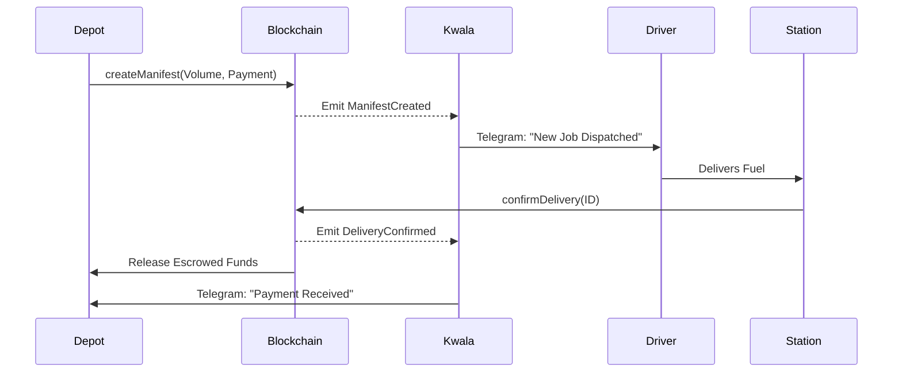

# ⛽ FuelFlow: Autonomous Fuel Distribution Layer

**FuelFlow** is a decentralized logistics and automation platform designed to streamline fuel distribution. By combining smart contracts with **Kwala's** off-chain automation, FuelFlow ensures real-time visibility and instant settlement for fuel deliveries.

---

## 🚀 Key Features

- **On-chain Manifests:** Every delivery is recorded immutably on the blockchain.
- **Escrowed Payments:** Funds are locked at dispatch and released instantly upon delivery confirmation.
- **Autonomous Orchestration:** Kwala monitors the blockchain to send Telegram notifications and trigger settlements.
- **Fleet Monitoring:** Proactive alerts if driver wallets run low on gas fees.
- **Premium Dashboard:** A high-end Next.js interface for managing the entire logistics lifecycle.

---

## 🏗️ Architecture



---

## 💻 The Dashboard

The **FuelFlow Command Center** is a modern Next.js application designed for ease of use:

- **Depot Panel:** Create manifests, set volumes, and approve stablecoin escrows.
- **Station Panel:** Real-time monitoring of incoming shipments and one-click delivery confirmation.
- **Wallet Integration:** Seamlessly connect via MetaMask or Coinbase Wallet.
- **Glassmorphic UI:** A premium, dark-mode design optimized for operations.

---

## 📂 Project Structure

```text
.
├── contracts/          # Solidity Smart Contracts (EVM)
├── frontend/           # Next.js Dashboard (TypeScript + Tailwind)
├── kwala/              # Kwala Workflow Configurations (YAML)
├── scripts/            # Deployment & Maintenance Scripts
├── test/               # TypeScript Unit Tests
└── SETUP_GUIDE.md      # End-to-end Deployment Manual
```

---

## ⚡ Getting Started

### 1. Installation
```bash
pnpm install
```

### 2. Configuration & Deployment
Refer to the [**Comprehensive Setup Guide**](./SETUP_GUIDE.md) for step-by-step instructions on:
- Obtaining wallet and API keys.
- Deploying to **Base Sepolia**.
- Activating **Kwala** workflows.

### 3. Running the Frontend
```bash
cd frontend
pnpm dev
```

### 4. Running Tests
```bash
pnpm test
```

---

## 🤖 Kwala Workflows

1. **Dispatcher:** Notifies drivers via Telegram when a new manifest is created.
2. **Gas Manager:** Monitors driver wallets and alerts the depot if they run low on gas fees.

---

## ⚖️ License
MIT
